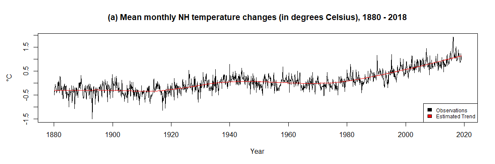
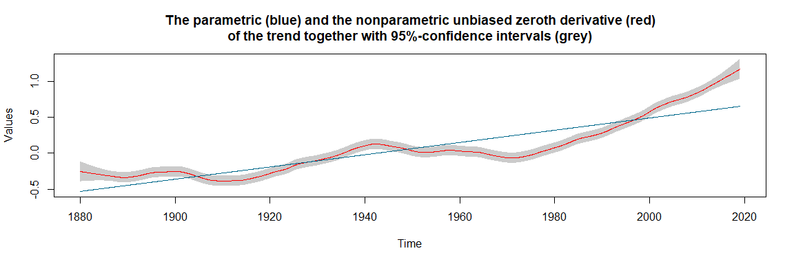

<!-- README.md is generated from README.Rmd. Please edit that file -->

# smoots

The goal of `smoots` is to provide an easy way to estimate the
nonparametric trend and its derivatives in trend-stationary, equidistant
time series with short-memory stationary errors. The main functions
allow for data-driven estimates via local polynomial regression with an
automatically selected optimal bandwidth.

## Installation

You can install the released version of `smoots` from
[CRAN](https://CRAN.R-project.org) with:

``` r
install.packages("smoots")
```

## Example 1: Estimation of the nonparametric trend function

This is a basic example which shows you how to solve a common problem.
The data `tempNH` in the package includes the mean monthly temperature
changes in degrees Celsius of the Northern Hemisphere (NH) from 1880 to
2018. The data was obtained from the Goddard Institute for Space Studies
of the National Aeronautics and Space Administration (NASA). To make use
of the `smoots` package, it has to be assumed that the data follows an
additive model consisting of a deterministic, nonparametric trend
function and a zero-mean stationary rest with short-range dependence.

The user-friendly and simply applicable function `msmooth()` for the
estimation of trend function in the additive model will be used.

``` r
library(smoots)          # Call the package
```

``` r
data <- tempNH           # Call the 'tempNH' data frame
Yt <- data$Change        # Store the actual values as a vector 

# Estimate the trend function via the 'smoots' package
results <- msmooth(Yt, p = 1, mu = 1, bStart = 0.15, alg = "A")

# Easily access the main estimation results
b.opt <- results$b0             # The optimal bandwidth
trend <- results$ye             # The trend estimates  
resid <- results$res            # The residuals
b.opt
#> [1] 0.101089
```



An optimal bandwidth of 0.101089 was selected by the iterative plug-in
algorithm (IPI) within `msmooth()`. Moreover, the estimated trend fits
the data suitably and the residuals seem to be stationary. Since the
trend was obtained without any parametric assumptions with respect to
the rest term, the detrended values could now be further analyzed by
means of any suitable parametric approach,
e.g. autoregressive-moving-average (ARMA) models.

## Example 2: Forecasting of trend-stationary time series

With the package version 1.1.0 different functions were newly introduced
that allow for forecasting trend-stationary series and other
functionalities. Based on the previous example, the following code shows
how to obtain point forecasts and 95% forecasting intervals for the mean
monthly temperature changes data and directly create a plot of the
forecasting results. For simplicity, it is assumed that the rest term of
the additive model follows an ARMA(1,1) model with normally distributed
innovations. However, via the functions a bootstrap method for
non-Gaussian cases can be applied as well. Furthermore, an automatic
order selection for the ARMA model is also built-in that is triggered,
if no values are passed to the respective arguments that define the
orders.

``` r
n <- length(Yt)
# Create a vector with exact time points (optional for the plot)
time <- seq(from = 1880 + 1 / 12, to = 2019, by = 1 / 12)

# Application of the forecasting function with automatic creation of a graphic
forecast <- modelCast(results, p = 1, q = 1, h = 5, alpha = 0.95, 
  method = "norm", plot = TRUE, x = time, type = "b", 
  col = "deepskyblue4", pch = 20, lty = 2, 
  main = "Title (series is cut-off)", 
  xlab = "Exemplary x-axis label", ylab = "Exemplary y-axis label")
```


``` r
forecast
#>             k=1       k=2       k=3       k=4       k=5
#> fcast 1.1041137 1.1151230 1.1240264 1.1313490 1.1374849
#> 2.5%  0.7468131 0.7281308 0.7212654 0.7199682 0.7213253
#> 97.5% 1.4614144 1.5021152 1.5267873 1.5427297 1.5536445
```

## Example 3: Testing the trend graphically for linearity

Another contribution that was made to package version 1.1.0 is a
function for testing the trend graphically for linearity. Based on a
previously obtained nonparametric estimate of the trend or its
derivatives, an asymptotically unbiased series of estimates with its
confidence bounds is obtained and plotted. By choice, different
polynomial regression lines can be displayed alongside the nonparametric
trend estimates and its confidence bounds. The estimated slope of a
simple linear regression model of the trend and the constant with value
zero are displayed against the estimates of the first and second
derivatives, respectively. If, for a selected confidence level 100s%,
clearly more than (1 - s)100% of the estimated parametric line lies
outside of the confidence bounds, the null hypothesis can be rejected.
The following example is based yet again on the mean monthly temperature
changes data and illustrates the linearity test with respect to the
nonparametric trend. The derivatives are skipped at this point for
simplicity. Moreover, a confidence level of 95% was chosen.

``` r
# Calculation of confidence bounds with creation of a graphic
bounds <- confBounds(results, alpha = 0.95, p = 1, x = time)
```



``` r
bounds
#> -----------------------------------------------
#> | Results of the confidence bounds estimation |
#> -----------------------------------------------
#>                               
#> Number of observations:   1668
#> Order of derivative:         0
#> Adjusted bandwidth:     0.0570
```

For the (asymptotically) unbiased estimation of the trend function an
adjusted bandwidth of 0.057 was used. Since more than 5% of the linear
regression line (blue) lies outside of the grey confidence bounds, we
can reject the null hypothesis that the trend is linear.

## Further applications

The trend estimation functions can also be used for the implementation
of semiparametric generalized autoregressive conditional
heteroskedasticity (Semi-GARCH) models and its various variants in
Financial Econometrics (see also the examples in the documentation of
`msmooth()` and `tsmooth()`).

## Functions

In `smoots` fourteen functions are available.

**Original functions since version 1.0.0:**

-   `dsmooth`: Data-driven Local Polynomial for the Trend’s Derivatives
    in Equidistant Time Series
-   `gsmooth`: Estimation of Trends and their Derivatives via Local
    Polynomial Regression
-   `knsmooth`: Estimation of Nonparametric Trend Functions via Kernel
    Regression
-   `msmooth`: Data-driven Nonparametric Regression for the Trend in
    Equidistant Time Series
-   `tsmooth`: Advanced Data-driven Nonparametric Regression for the
    Trend in Equidistant Time Series

**Newly introduced with version 1.1.0:**

-   `rescale`: Rescaling Derivative Estimates
-   `critMatrix`: ARMA Order Selection Matrix
-   `optOrd`: Optimal Order Selection
-   `normCast`: Forecasting Function for ARMA Models under Normally
    Distributed Innovations
-   `bootCast`: Forecasting Function for ARMA Models via Bootstrap
-   `trendCast`: Forecasting Function for Nonparametric Trend Functions
-   `modelCast`: Forecasting Function for Trend-Stationary Time Series
-   `rollCast`: Backtesting Semi-ARMA Models with Rolling Forecasts
-   `confBounds`: Asymptotically Unbiased Confidence Bounds

For further information on each of the functions, we refer the user to
the manual or the package documentation.
